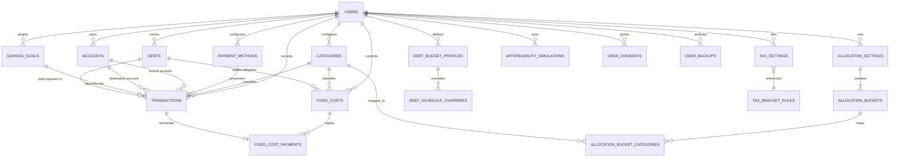

# 🏛️ Walletly (FinSmart Thai) — Enterprise Database Design Specification

**Project:** Walletly (FinSmart Thai / Future Wallet)  
**Document Version:** 2.0 (Comprehensive Production Architecture)  
**Database Target:** Microsoft SQL Server 2022+ / Azure SQL Database / LocalDB (with full PostgreSQL 16+ parity)  
**ORM Compatibility:** Entity Framework Core (`Microsoft.EntityFrameworkCore.SqlServer` / `Npgsql.EntityFrameworkCore.PostgreSQL`)  
**Status:** Completed & Production-Ready  

---

## 📑 สารบัญ (Table of Contents)

1. [บทนำและวัตถุประสงค์ (Executive Summary & Architectural Scope)](#1-บทนำและวัตถุประสงค์-executive-summary--architectural-scope)
2. [สถาปัตยกรรมระบบและแนวคิดการออกแบบ (System Architecture & Principles)](#2-สถาปัตยกรรมระบบและแนวคิดการออกแบบ-system-architecture--principles)
3. [แบบจำลองความสัมพันธ์ข้อมูล (Conceptual & Logical ER Diagram)](#3-แบบจำลองความสัมพันธ์ข้อมูล-conceptual--logical-er-diagram)
4. [พจนานุกรมข้อมูลรายตารางอย่างละเอียด (Comprehensive Data Dictionary)](#4-พจนานุกรมข้อมูลรายตารางอย่างละเอียด-comprehensive-data-dictionary)
   - 4.1 กลุ่ม Authentication, User Profile & PDPA Consent
   - 4.2 กลุ่ม Accounts (บัญชี/กระเป๋าเงิน) & Categories & Payment Methods
   - 4.3 กลุ่ม Transactions & Recurring Management
   - 4.4 กลุ่ม Fixed Costs & Monthly Payment Reconciliation
   - 4.5 กลุ่ม Budget Allocation (สัดส่วนงบประมาณ 50/30/20 & 6 Jars)
   - 4.6 กลุ่ม Savings & Wealth Goals (เป้าหมายเงินออม & ดอกเบี้ยทบต้น)
   - 4.7 กลุ่ม Debt Payoff Planner (แผนปลดหนี้อัจฉริยะ 3 รูปแบบหนี้)
   - 4.8 กลุ่ม Thai Personal Income Tax (ภาษีเงินได้บุคคลธรรมดา ภ.ง.ด. 90/91)
   - 4.9 กลุ่ม Cash Flow Simulation & "Can I Afford It?" Simulator
   - 4.10 กลุ่ม Backups, Snapshots & Audit Logs
5. [กลยุทธ์การสร้างดัชนีและประสิทธิภาพ (Indexing & Performance Strategy)](#5-กลยุทธ์การสร้างดัชนีและประสิทธิภาพ-indexing--performance-strategy)
6. [กฎความปลอดภัยและการปฏิบัติตาม PDPA (Data Security & PDPA Compliance)](#6-กฎความปลอดภัยและการปฏิบัติตาม-pdpa-data-security--pdpa-compliance)
7. [ขั้นตอนการย้ายข้อมูล (Migration Strategy from LocalStorage to RDBMS)](#7-ขั้นตอนการย้ายข้อมูล-migration-strategy-from-localstorage-to-rdbms)
8. [สรุปโครงสร้างไฟล์ DDL และ Seed Data (File Inventory)](#8-สรุปโครงสร้างไฟล์-ddl-และ-seed-data-file-inventory)

---

## 1. บทนำและวัตถุประสงค์ (Executive Summary & Architectural Scope)

เดิมแอปพลิเคชัน **Walletly** ทำงานเป็นแบบ Frontend-Only บนเบราว์เซอร์ โดยเก็บสถานะทั้งหมดไว้ใน Web Storage (`localStorage`) ผ่าน [WalletContext.jsx](file:///d:/FE_wallet/src/context/WalletContext.jsx) ข้อจำกัดของสถาปัตยกรรมเดิมคือ:
- ข้อมูลสูญหายเมื่อผู้ใช้ล้างแคชเบราว์เซอร์หรือเปลี่ยนอุปกรณ์
- ไม่รองรับระบบสมาชิกจริงที่มีการยืนยันตัวตน (Authentication & Multi-tenancy)
- ประวัติการชำระฟิกคอสรายเดือนสูญหายเมื่อกดรีเซ็ตรอบเดือนใหม่ (`resetFixedCostsMonthly`)
- การคำนวณยอดเงินออมสะสมมีแหล่งข้อมูลซ้ำซ้อนสองที่ (`savingsGoals.currentAmount` และ `transactions`)

เอกสารฉบับนี้ออกแบบโครงสร้างฐานข้อมูลเชิงสัมพันธ์ระดับองค์กร (**Enterprise Relational Database Design**) เพื่อรองรับทุกฟังก์ชันการทำงานของ Walletly โดยครอบคลุม 10 ขอบเขตงาน (Domains) หลัก พร้อมออกแบบ Schema ที่มีความถูกต้องระดับ 3NF (Third Normal Form), ป้องกัน Data Anomalies, และรองรับการทำ Scale-out สำหรับแอปพลิเคชันการเงินยุคใหม่

---

## 2. สถาปัตยกรรมระบบและแนวคิดการออกแบบ (System Architecture & Principles)

### 2.1 Multi-Tenant Isolation by `user_id`
- ข้อมูลธุรกรรม, หนี้สิน, ภาษี, ฟิกคอส, และกระเป๋าเงินทั้งหมดถูกผูกกับ `user_id` โดยตรง
- กำหนดสิทธิ์ Foreign Key Constraints แบบ `ON DELETE CASCADE` จาก `users` สู่ Entity หลักของผู้ใช้นั้น เพื่อรองรับการลบข้อมูลตามสิทธิ PDPA (Right to be Forgotten)

### 2.2 Single Source of Truth สำหรับยอดเงินสะสม (Derived Balances)
- **Savings Goals:** เลิกเก็บฟิลด์ `current_amount` ในตาราง `savings_goals` แบบ Hard-coded แต่คำนวณผ่าน Aggregate Function:
  $$\text{Current Goal Amount} = \text{initial\_amount} + \sum \text{transactions.amount}$$
- **Account Balances:** ออกแบบตาราง `accounts` พร้อม Transaction Ledger ที่สามารถ Reconcile ยอดคงเหลือจริงกับประวัติธุรกรรมได้อย่างแม่นยำ

### 2.3 การรองรับหนี้สิน 3 รูปแบบตามมาตรฐานการเงินไทย
ระบบ Debt Planner ของ Walletly แยกการคิดดอกเบี้ยหนี้สินอย่างเข้มงวด:
1. **Amortizing (ลดต้นลดดอก):** คิดดอกเบี้ยทุกเดือนตามเงินต้นคงเหลือจริง รองรับขั้นต่ำแบบคงที่และแบบ % ของยอดคงเหลือ (เช่น บัตรเครดิต 8% ขั้นต่ำ 500 บาท)
2. **Hire Purchase (เช่าซื้อรถยนต์/มอเตอร์ไซค์):** คิดดอกเบี้ยแบบ Flat Rate เบ็ดเสร็จตั้งแต่วันทำสัญญา ยอดหนี้คือ $\text{ค่างวด} \times \text{งวดที่เหลือ}$ เท่านั้น ปิดก่อนได้ลดหย่อนตามส่วนลดที่ระบุใน Settlement Quote
3. **Installment (ผ่อนสินค้า 0%):** ไม่มีภาระดอกเบี้ย ยอดหนี้ลดลงตรงไปตรงมาตามงวด

### 2.4 Thai Tax Compliance Engine (ภ.ง.ด. 90/91)
- ตาราง `tax_settings` รองรับโครงสร้างการคำนวณภาษีบุคคลธรรมดาปีปัจจุบันของกรมสรรพากร:
  - รายได้ 40(1) เงินเดือน, 40(2) ฟรีแลนซ์/โบนัส หักค่าใช้จ่าย 50% สูงสุด 100,000 บาท
  - สิทธิลดหย่อนครอบครัว (ตนเอง 60,000 บาท, บิดามารดาคนละ 30,000 บาท, บุตร)
  - ประกันชีวิต (สูงสุด 100,000), ประกันสุขภาพ (สูงสุด 25,000 รวมประกันชีวิตไม่เกิน 100,000)
  - กลุ่มกองทุนเกษียณ SSF + RMF + PVD (เพดานรวมไม่เกิน 500,000 บาท)
  - กองทุน ThaiESG (แยกโควตา 300,000 บาท)
  - ดอกเบี้ยเงินกู้เพื่อที่อยู่อาศัย (สูงสุด 100,000 บาท)
  - Easy E-Receipt และ เงินบริจาคทั่วไป (ไม่เกิน 10% หลังหักลดหย่อน)

---

## 3. แบบจำลองความสัมพันธ์ข้อมูล (Conceptual & Logical ER Diagram)



---

## 4. พจนานุกรมข้อมูลรายตารางอย่างละเอียด (Comprehensive Data Dictionary)

### 4.1 กลุ่ม Authentication, User Profile & PDPA Consent

#### 1. ตาราง `users`
ตารางจัดเก็บข้อมูลบัญชีผู้ใช้งานระบบ ทั้งแบบ Local Password, Social OAuth (Google/Facebook), และ Guest Mode

| ชื่อคอลัมน์ (Column Name) | ชนิดข้อมูล (Data Type) | Nullable | Default | คำอธิบายและความสัมพันธ์ (Description & Constraints) |
|---|---|:---:|---|---|
| `id` | `UNIQUEIDENTIFIER` | NO | `NEWSEQUENTIALID()` | Primary Key (GUID v4/v7 sequence) |
| `email` | `NVARCHAR(256)` | NO | - | อีเมลสำหรับล็อกอิน, Unique Constraint |
| `password_hash` | `NVARCHAR(512)` | YES | NULL | แฮชรหัสผ่าน (Argon2id หรือ BCrypt) - เป็น NULL กรณีล็อกอินผ่าน OAuth/Guest |
| `display_name` | `NVARCHAR(128)` | NO | 'ผู้ใช้งาน' | ชื่อที่แสดงผลในระบบ |
| `avatar_url` | `NVARCHAR(512)` | YES | NULL | ลิงก์รูปโปรไฟล์ |
| `auth_provider` | `NVARCHAR(32)` | NO | 'local' | แหล่งที่มาบัญชี: `'local'`, `'google'`, `'facebook'`, `'guest'` |
| `provider_id` | `NVARCHAR(256)` | YES | NULL | รหัส ID จาก OAuth Identity Provider |
| `is_guest` | `BIT` | NO | 0 | สถานะบัญชีชั่วคราว (Guest Account) |
| `is_active` | `BIT` | NO | 1 | สถานะการใช้งานบัญชี (1=ใช้งาน, 0=ระงับการใช้งาน) |
| `created_at` | `DATETIME2(3)` | NO | `SYSUTCDATETIME()` | วันเวลาที่ลงทะเบียนในระบบ |
| `updated_at` | `DATETIME2(3)` | NO | `SYSUTCDATETIME()` | วันเวลาที่อัปเดตข้อมูลล่าสุด |
| `last_login_at` | `DATETIME2(3)` | YES | NULL | วันเวลาที่เข้าสู่ระบบครั้งล่าสุด |

#### 2. ตาราง `user_refresh_tokens`
ตารางจัดเก็บ Session Token และ Refresh Token สำหรับการทำ Stateless JWT Bearer Authentication

| ชื่อคอลัมน์ | ชนิดข้อมูล | Nullable | Default | คำอธิบาย |
|---|---|:---:|---|---|
| `id` | `BIGINT IDENTITY(1,1)` | NO | - | Primary Key |
| `user_id` | `UNIQUEIDENTIFIER` | NO | - | Foreign Key -> `users(id)` ON DELETE CASCADE |
| `token_hash` | `NVARCHAR(256)` | NO | - | แฮชของ Refresh Token ป้องกันการรั่วไหล |
| `device_info` | `NVARCHAR(256)` | YES | NULL | ข้อมูลอุปกรณ์และเบราว์เซอร์ |
| `ip_address` | `NVARCHAR(64)` | YES | NULL | IP Address ที่ขอสร้าง Token |
| `expires_at` | `DATETIME2(3)` | NO | - | วันเวลาหมดอายุของ Token |
| `revoked_at` | `DATETIME2(3)` | YES | NULL | วันเวลาที่ Token ถูกยกเลิก |
| `created_at` | `DATETIME2(3)` | NO | `SYSUTCDATETIME()` | วันเวลาที่สร้าง Token |

#### 3. ตาราง `user_consents` (PDPA & Cookie Audit Trail)
ตารางบันทึกประวัติความยินยอมการใช้งานคุกกี้และนโยบายความเป็นส่วนตัวตามกฎหมาย PDPA ของไทย

| ชื่อคอลัมน์ | ชนิดข้อมูล | Nullable | Default | คำอธิบาย |
|---|---|:---:|---|---|
| `id` | `BIGINT IDENTITY(1,1)` | NO | - | Primary Key |
| `user_id` | `UNIQUEIDENTIFIER` | YES | NULL | Foreign Key -> `users(id)` ON DELETE CASCADE (เป็น NULL ได้ถ้าเป็น Guest/ยังไม่ล็อกอิน) |
| `anonymous_id` | `NVARCHAR(128)` | YES | NULL | รหัสประจำตัว Anonymous Session จากเบราว์เซอร์ |
| `policy_version` | `NVARCHAR(32)` | NO | '1.0' | เวอร์ชั่นของนโยบายความเป็นส่วนตัวที่ผู้ใช้ยอมรับ |
| `consent_necessary`| `BIT` | NO | 1 | คุกกี้ที่จำเป็นต่อการทำงานของระบบ (บังคับ 1 เสมอ) |
| `consent_functional`| `BIT` | NO | 0 | คุกกี้เพื่อการทำงานและจดจำการตั้งค่า |
| `consent_analytics` | `BIT` | NO | 0 | คุกกี้เพื่อการวิเคราะห์และสถิติ |
| `consent_marketing` | `BIT` | NO | 0 | คุกกี้เพื่อการโฆษณาและการตลาด |
| `ip_address` | `NVARCHAR(64)` | YES | NULL | IP Address ขณะกดยอมรับ เพื่อเป็นหลักฐาน Audit |
| `user_agent` | `NVARCHAR(512)` | YES | NULL | User-Agent ของเบราว์เซอร์ |
| `consented_at` | `DATETIME2(3)` | NO | `SYSUTCDATETIME()` | วันเวลาที่บันทึกความยินยอม |

---

### 4.2 กลุ่ม Accounts, Categories & Payment Methods

#### 4. ตาราง `accounts` (บัญชีและกระเป๋าเงิน)
รองรับการจัดการสินทรัพย์หลายบัญชี เช่น บัญชีออมทรัพย์, บัญชี Kept, บัตรเครดิต, กระเป๋าเงินสด, e-Wallet

| ชื่อคอลัมน์ | ชนิดข้อมูล | Nullable | Default | คำอธิบาย |
|---|---|:---:|---|---|
| `id` | `UNIQUEIDENTIFIER` | NO | `NEWSEQUENTIALID()` | Primary Key |
| `user_id` | `UNIQUEIDENTIFIER` | NO | - | Foreign Key -> `users(id)` ON DELETE CASCADE |
| `name` | `NVARCHAR(100)` | NO | - | ชื่อบัญชี (เช่น "KBANK ออมทรัพย์", "Kept Grow") |
| `account_type` | `NVARCHAR(32)` | NO | 'bank' | ประเภท: `'bank'`, `'cash'`, `'credit_card'`, `'e_wallet'`, `'investment'` |
| `current_balance`| `DECIMAL(18,2)` | NO | 0.00 | ยอดเงินคงเหลือปัจจุบัน (คำนวณปรับตามธุรกรรม) |
| `credit_limit` | `DECIMAL(18,2)` | YES | NULL | วงเงินบัตรเครดิต (ถ้าเป็นบัตรเครดิต) |
| `billing_day` | `TINYINT` | YES | NULL | วันตัดรอบบิล (1-31) |
| `currency` | `CHAR(3)` | NO | 'THB' | รหัสสกุลเงินมาตรฐาน ISO 4217 |
| `color` | `NVARCHAR(32)` | YES | 'blue' | โค้ดสีสำหรับแสดงผลใน UI |
| `icon` | `NVARCHAR(64)` | YES | 'Wallet' | ชื่อ Icon จาก Lucide React |
| `include_in_net_worth`| `BIT` | NO | 1 | นำมาคิดในสินทรัพย์สุทธิรวมหรือไม่ |
| `is_active` | `BIT` | NO | 1 | สถานะการเปิดใช้งานบัญชี |
| `created_at` | `DATETIME2(3)` | NO | `SYSUTCDATETIME()` | วันเวลาที่สร้าง |
| `updated_at` | `DATETIME2(3)` | NO | `SYSUTCDATETIME()` | วันเวลาที่แก้ไขล่าสุด |

#### 5. ตาราง `categories` (หมวดหมู่รายรับ-รายจ่าย)
หมวดหมู่มาตรฐานถูก Seed ตอนสมัครสมาชิก และผู้ใช้สามารถเพิ่ม/ลบ/เปลี่ยนชื่อ/สีได้เอง

| ชื่อคอลัมน์ | ชนิดข้อมูล | Nullable | Default | คำอธิบาย |
|---|---|:---:|---|---|
| `id` | `UNIQUEIDENTIFIER` | NO | `NEWSEQUENTIALID()` | Primary Key |
| `user_id` | `UNIQUEIDENTIFIER` | NO | - | Foreign Key -> `users(id)` ON DELETE CASCADE |
| `type` | `NVARCHAR(20)` | NO | - | ประเภทหมวด: `'income'`, `'expense'`, `'fixed'`, `'savings'` |
| `name` | `NVARCHAR(128)` | NO | - | ชื่อหมวดหมู่ (เช่น "อาหารและเครื่องดื่ม", "เงินเดือน") |
| `color` | `NVARCHAR(32)` | YES | NULL | สีธีมของหมวดหมู่ |
| `icon` | `NVARCHAR(64)` | YES | NULL | ไอคอนประกอบหมวดหมู่ |
| `sort_order` | `INT` | NO | 0 | ลำดับการจัดเรียงในเมนู Dropdown |
| `is_system_default`| `BIT` | NO | 0 | สร้างมาจากระบบเริ่มต้นหรือไม่ |
| `is_active` | `BIT` | NO | 1 | สถานะการใช้งาน (ใช้ Soft Delete เพื่อรักษาประวัติธุรกรรมเดิม) |
| `created_at` | `DATETIME2(3)` | NO | `SYSUTCDATETIME()` | วันเวลาที่สร้าง |

*Integrity Constraint:* `UNIQUE (user_id, type, name)` ป้องกันการสร้างชื่อหมวดหมู่ซ้ำในประเภทเดียวกันของผู้ใช้คนเดียวกัน

#### 6. ตาราง `payment_methods` (ช่องทางการชำระเงิน)

| ชื่อคอลัมน์ | ชนิดข้อมูล | Nullable | Default | คำอธิบาย |
|---|---|:---:|---|---|
| `id` | `UNIQUEIDENTIFIER` | NO | `NEWSEQUENTIALID()` | Primary Key |
| `user_id` | `UNIQUEIDENTIFIER` | NO | - | Foreign Key -> `users(id)` ON DELETE CASCADE |
| `name` | `NVARCHAR(100)` | NO | - | ชื่อช่องทาง (เช่น "โอนผ่านธนาคาร", "สแกน QR", "เงินสด", "บัตรเครดิต") |
| `account_id` | `UNIQUEIDENTIFIER` | YES | NULL | Foreign Key -> `accounts(id)` ON DELETE SET NULL (เชื่อมโยงบัญชีตัดเงินจริง) |
| `sort_order` | `INT` | NO | 0 | ลำดับการแสดงผล |
| `is_system_default`| `BIT` | NO | 0 | ช่องทางเริ่มต้นของระบบ |
| `is_active` | `BIT` | NO | 1 | สถานะเปิดใช้งาน |
| `created_at` | `DATETIME2(3)` | NO | `SYSUTCDATETIME()` | วันเวลาที่สร้าง |

*Integrity Constraint:* `UNIQUE (user_id, name)`

---

### 4.3 กลุ่ม Transactions & Recurring Management

#### 7. ตาราง `transactions` (บันทึกรายรับ-รายจ่าย)
ตารางศูนย์กลางที่บันทึกกระแสเงินสดเข้า-ออกทั้งหมดของระบบ

| ชื่อคอลัมน์ | ชนิดข้อมูล | Nullable | Default | คำอธิบาย |
|---|---|:---:|---|---|
| `id` | `UNIQUEIDENTIFIER` | NO | `NEWSEQUENTIALID()` | Primary Key |
| `user_id` | `UNIQUEIDENTIFIER` | NO | - | Foreign Key -> `users(id)` ON DELETE CASCADE |
| `type` | `NVARCHAR(20)` | NO | - | `'income'`, `'expense'`, `'fixed'`, `'savings'`, `'transfer'` |
| `amount` | `DECIMAL(18,2)` | NO | - | ยอดเงินในธุรกรรม (ต้องมากกว่า 0 เสมอ) |
| `tx_date` | `DATE` | NO | - | วันที่ทำรายการ (YYYY-MM-DD) |
| `category_id` | `UNIQUEIDENTIFIER` | NO | - | Foreign Key -> `categories(id)` ON DELETE RESTRICT |
| `payment_method_id`| `UNIQUEIDENTIFIER`| YES | NULL | Foreign Key -> `payment_methods(id)` ON DELETE RESTRICT |
| `account_id` | `UNIQUEIDENTIFIER` | YES | NULL | Foreign Key -> `accounts(id)` ON DELETE SET NULL (บัญชีต้นทาง) |
| `destination_account_id`| `UNIQUEIDENTIFIER`| YES | NULL | Foreign Key -> `accounts(id)` ON DELETE NO ACTION (บัญชีปลายทาง กรณีโอนเงิน) |
| `savings_goal_id` | `UNIQUEIDENTIFIER` | YES | NULL | Foreign Key -> `savings_goals(id)` ON DELETE SET NULL (กรณีฝากเงินเข้าเป้าหมาย) |
| `fixed_cost_id` | `UNIQUEIDENTIFIER` | YES | NULL | Foreign Key -> `fixed_costs(id)` ON DELETE SET NULL (กรณีจ่ายฟิกคอส) |
| `debt_id` | `UNIQUEIDENTIFIER` | YES | NULL | Foreign Key -> `debts(id)` ON DELETE SET NULL (กรณีจ่ายค่างวดหนี้) |
| `note` | `NVARCHAR(500)` | YES | NULL | บันทึกช่วยจำรายละเอียดรายการ |
| `is_recurring` | `BIT` | NO | 0 | รายการที่เกิดขึ้นเป็นประจำหรือไม่ |
| `created_at` | `DATETIME2(3)` | NO | `SYSUTCDATETIME()` | วันเวลาที่บันทึกข้อมูลเข้าระบบ |
| `updated_at` | `DATETIME2(3)` | NO | `SYSUTCDATETIME()` | วันเวลาที่แก้ไขรายการล่าสุด |

---

### 4.4 กลุ่ม Fixed Costs & Monthly Payment Reconciliation

#### 8. ตาราง `fixed_costs` (ภาระค่าใช้จ่ายคงที่ประจำเดือน)

| ชื่อคอลัมน์ | ชนิดข้อมูล | Nullable | Default | คำอธิบาย |
|---|---|:---:|---|---|
| `id` | `UNIQUEIDENTIFIER` | NO | `NEWSEQUENTIALID()` | Primary Key |
| `user_id` | `UNIQUEIDENTIFIER` | NO | - | Foreign Key -> `users(id)` ON DELETE CASCADE |
| `category_id` | `UNIQUEIDENTIFIER` | NO | - | Foreign Key -> `categories(id)` ON DELETE RESTRICT |
| `title` | `NVARCHAR(150)` | NO | - | ชื่อรายการ (เช่น "ผ่อนคอนโด", "ค่างวดรถยนต์", "Netflix") |
| `amount` | `DECIMAL(18,2)` | NO | - | ยอดเงินที่ต้องชำระในแต่ละเดือน (บาท) |
| `due_day` | `TINYINT` | NO | 1 | วันครบกำหนดชำระของทุกเดือน (ค่าระหว่าง 1-31) |
| `is_paid` | `BIT` | NO | 0 | สถานะชำระรอบเดือนปัจจุบัน (สำหรับ UI Toggle) |
| `auto_deduct` | `BIT` | NO | 0 | หักบัญชีอัตโนมัติหรือไม่ |
| `is_active` | `BIT` | NO | 1 | ใช้งานอยู่ในปัจจุบันหรือไม่ |
| `linked_debt_id`| `UNIQUEIDENTIFIER`| YES | NULL | Foreign Key -> `debts(id)` ON DELETE SET NULL (เชื่อมโยงหนี้ใน Debt Planner) |
| `note` | `NVARCHAR(500)` | YES | NULL | หมายเหตุเพิ่มเติม |
| `created_at` | `DATETIME2(3)` | NO | `SYSUTCDATETIME()` | วันเวลาที่สร้าง |
| `updated_at` | `DATETIME2(3)` | NO | `SYSUTCDATETIME()` | วันเวลาที่อัปเดต |

#### 9. ตาราง `fixed_cost_payments` (ประวัติการชำระฟิกคอสรายเดือน)
*แก้ปัญหาข้อบกพร่องใน LocalStorage:* เมื่อกด "เริ่มรอบเดือนใหม่" ประวัติการจ่ายเงินของเดือนที่ผ่านมาจะไม่สูญหาย และสามารถตรวจสอบย้อนหลังได้ว่าเดือนไหนจ่ายตรงเวลาบ้าง

| ชื่อคอลัมน์ | ชนิดข้อมูล | Nullable | Default | คำอธิบาย |
|---|---|:---:|---|---|
| `id` | `UNIQUEIDENTIFIER` | NO | `NEWSEQUENTIALID()` | Primary Key |
| `fixed_cost_id` | `UNIQUEIDENTIFIER` | NO | - | Foreign Key -> `fixed_costs(id)` ON DELETE CASCADE |
| `period_month` | `DATE` | NO | - | วันที่ 1 ของรอบเดือนที่ชำระ (เช่น `2026-08-01`) |
| `amount_paid` | `DECIMAL(18,2)` | NO | - | ยอดเงินจริงที่ชำระในรอบเดือนนั้น |
| `paid_at` | `DATETIME2(3)` | NO | `SYSUTCDATETIME()` | วันเวลาที่กดชำระเงินจริง |
| `transaction_id`| `UNIQUEIDENTIFIER`| YES | NULL | Foreign Key -> `transactions(id)` ON DELETE SET NULL (ลิงก์กับ Transaction บัญชี) |
| `is_on_time` | `BIT` | NO | 1 | ชำระตรงตามกำหนด Due Day หรือไม่ |
| `note` | `NVARCHAR(256)` | YES | NULL | หมายเหตุการชำระ |

*Integrity Constraint:* `UNIQUE (fixed_cost_id, period_month)` ป้องกันการบันทึกชำระซ้ำซ้อนในรอบเดือนเดียวกัน

---

### 4.5 กลุ่ม Budget Allocation (Bucket Budgeting)

#### 10. ตาราง `allocation_settings` (การตั้งค่าสัดส่วนงบประมาณ)

| ชื่อคอลัมน์ | ชนิดข้อมูล | Nullable | Default | คำอธิบาย |
|---|---|:---:|---|---|
| `id` | `UNIQUEIDENTIFIER` | NO | `NEWSEQUENTIALID()` | Primary Key |
| `user_id` | `UNIQUEIDENTIFIER` | NO | - | Foreign Key -> `users(id)` ON DELETE CASCADE, UNIQUE |
| `rule_key` | `NVARCHAR(50)` | NO | '50-30-20' | คีย์สูตรที่เลือก: `'50-30-20'`, `'60-20-20'`, `'70-20-10'`, `'6jars'`, `'custom'` |
| `monthly_income`| `DECIMAL(18,2)` | NO | 0.00 | ฐานรายได้ต่อเดือนที่ใช้คำนวณจัดสรร (บาท) |
| `notes` | `NVARCHAR(500)` | YES | NULL | บันทึกกลยุทธ์การจัดสรรงบ |
| `updated_at` | `DATETIME2(3)` | NO | `SYSUTCDATETIME()` | วันเวลาที่แก้ไขล่าสุด |

#### 11. ตาราง `allocation_buckets` (ถังงบประมาณย่อย)
โครงสร้าง Normalization เพื่อให้รองรับสูตรที่มีจำนวนถังไม่เท่ากัน (3 ถังใน 50/30/20 หรือ 6 ถังใน 6 Jars)

| ชื่อคอลัมน์ | ชนิดข้อมูล | Nullable | Default | คำอธิบาย |
|---|---|:---:|---|---|
| `id` | `UNIQUEIDENTIFIER` | NO | `NEWSEQUENTIALID()` | Primary Key |
| `allocation_settings_id` | `UNIQUEIDENTIFIER` | NO | - | Foreign Key -> `allocation_settings(id)` ON DELETE CASCADE |
| `bucket_key` | `NVARCHAR(50)` | NO | - | คีย์ประจำถัง (เช่น `'needs'`, `'wants'`, `'savings'`, `'ffa'`) |
| `name` | `NVARCHAR(100)` | NO | - | ชื่อที่แสดง (เช่น "จำเป็น (Needs & Fixed Costs)") |
| `target_percent` | `DECIMAL(5,2)` | NO | - | สัดส่วนเปอร์เซ็นต์เป้าหมาย (0.00 - 100.00) |
| `color` | `NVARCHAR(32)` | YES | 'blue' | สีแท่งกราฟ |
| `sort_order` | `INT` | NO | 0 | ลำดับการแสดงผล |

*Integrity Constraint:* `UNIQUE (allocation_settings_id, bucket_key)`

#### 12. ตาราง `allocation_bucket_categories` (การผูกหมวดหมู่เข้ากับถังงบประมาณ)
ช่วยให้ระบบเปรียบเทียบงบประมาณที่ตั้งไว้ (Budgeted) กับยอดใช้จ่ายจริง (Actual) ได้แบบ Real-time

| ชื่อคอลัมน์ | ชนิดข้อมูล | Nullable | Default | คำอธิบาย |
|---|---|:---:|---|---|
| `id` | `BIGINT IDENTITY(1,1)` | NO | - | Primary Key |
| `bucket_id` | `UNIQUEIDENTIFIER` | NO | - | Foreign Key -> `allocation_buckets(id)` ON DELETE CASCADE |
| `category_id`| `UNIQUEIDENTIFIER` | NO | - | Foreign Key -> `categories(id)` ON DELETE CASCADE |

---

### 4.6 กลุ่ม Savings & Wealth Goals

#### 13. ตาราง `savings_goals` (เป้าหมายเงินออมและการลงทุน)

| ชื่อคอลัมน์ | ชนิดข้อมูล | Nullable | Default | คำอธิบาย |
|---|---|:---:|---|---|
| `id` | `UNIQUEIDENTIFIER` | NO | `NEWSEQUENTIALID()` | Primary Key |
| `user_id` | `UNIQUEIDENTIFIER` | NO | - | Foreign Key -> `users(id)` ON DELETE CASCADE |
| `title` | `NVARCHAR(150)` | NO | - | ชื่อเป้าหมาย (เช่น "เงินสำรองฉุกเฉิน 6 เดือน", "พอร์ต DCA เกษียณ") |
| `category` | `NVARCHAR(100)` | NO | 'ความมั่นคง'| หมวดหมู่เป้าหมาย: `'ความมั่นคง'`, `'การลงทุน'`, `'ท่องเที่ยว'`, `'อื่นๆ'` |
| `target_amount` | `DECIMAL(18,2)` | NO | - | ยอดเงินเป้าหมายที่ต้องการ (บาท) |
| `initial_amount`| `DECIMAL(18,2)` | NO | 0.00 | ยอดเงินเริ่มต้นที่มีอยู่ก่อนเริ่มระบบ |
| `monthly_contribution`| `DECIMAL(18,2)`| NO | 0.00 | แผนการฝากเงินสมทบต่อเดือน |
| `target_date` | `DATE` | YES | NULL | วันที่คาดหวังว่าจะบรรลุเป้าหมาย |
| `expected_return_rate`| `DECIMAL(5,2)` | YES | NULL | อัตราผลตอบแทนคาดหวังต่อปี (% สำหรับคำนวณดอกเบี้ยทบต้น) |
| `color` | `NVARCHAR(32)` | YES | 'emerald' | สีธีมของการ์ดเป้าหมาย |
| `is_completed` | `BIT` | NO | 0 | บรรลุเป้าหมายเรียบร้อยแล้วหรือไม่ |
| `created_at` | `DATETIME2(3)` | NO | `SYSUTCDATETIME()` | วันเวลาที่สร้าง |
| `updated_at` | `DATETIME2(3)` | NO | `SYSUTCDATETIME()` | วันเวลาที่แก้ไข |

---

### 4.7 กลุ่ม Debt Payoff Planner Engine (ระบบแผนปลอดหนี้)

#### 14. ตาราง `debts` (บัญชีหนี้สินทุกประเภท)

| ชื่อคอลัมน์ | ชนิดข้อมูล | Nullable | Default | คำอธิบายและความสำคัญ |
|---|---|:---:|---|---|
| `id` | `UNIQUEIDENTIFIER` | NO | `NEWSEQUENTIALID()` | Primary Key |
| `user_id` | `UNIQUEIDENTIFIER` | NO | - | Foreign Key -> `users(id)` ON DELETE CASCADE |
| `name` | `NVARCHAR(150)` | NO | - | ชื่อหนี้ (เช่น "สินเชื่อบ้าน ธอส.", "ผ่อนรถ Honda City", "ผ่อน iPhone 16") |
| `type` | `NVARCHAR(30)` | NO | - | ประเภทหนี้: `'amortizing'`, `'hirePurchase'`, `'installment'` |
| `is_closed` | `BIT` | NO | 0 | ปิดบัญชีหนี้เรียบร้อยแล้วหรือไม่ (1=หมดหนี้แล้ว) |
| **[เฉพาะ Amortizing]** | | | | *(สินเชื่อบ้าน, สินเชื่อส่วนบุคคล, บัตรกดเงินสด)* |
| `principal` | `DECIMAL(18,2)` | YES | NULL | ยอดเงินต้นคงเหลือปัจจุบัน |
| `accrued_interest`| `DECIMAL(18,2)` | NO | 0.00 | ดอกเบี้ยค้างชำระยกยอดมา |
| `annual_rate_pct` | `DECIMAL(6,3)` | YES | NULL | อัตราดอกเบี้ยต่อปี (% เช่น 6.575, 16.000, 25.000) |
| `frequency` | `NVARCHAR(20)` | NO | 'monthly' | ความถี่การจ่ายดอกเบี้ย: `'monthly'`, `'annual'` |
| `annual_due_month`| `TINYINT` | YES | NULL | เดือนที่ต้องจ่ายกรณี frequency='annual' (1-12) |
| `accepts_early_payment`| `BIT` | NO | 1 | โปะเงินต้นได้ทันทีหรือไม่ (0=ต้องสะสมเงินไว้จ่ายใน due month) |
| `min_payment_mode`| `NVARCHAR(20)` | NO | 'none' | โหมดจ่ายขั้นต่ำ: `'none'`, `'fixed'`, `'percentOfBalance'` |
| `min_payment_amount`| `DECIMAL(18,2)`| YES | NULL | ยอดเงินจ่ายขั้นต่ำแบบคงที่ (กรณี mode='fixed') |
| `min_payment_percent`| `DECIMAL(5,2)` | YES | NULL | เปอร์เซ็นต์ขั้นต่ำของยอดหนี้ (เช่น 8% สำหรับบัตรเครดิต) |
| `min_payment_floor`| `DECIMAL(18,2)` | YES | NULL | ยอดขั้นต่ำที่เป็นเพดานล่างสุด (เช่น 500 บาท) |
| **[เฉพาะ HirePurchase & Installment]** | | | | *(เช่าซื้อรถยนต์, ผ่อนสินค้า 0%)* |
| `monthly_payment` | `DECIMAL(18,2)` | YES | NULL | ค่างวดคงที่ต่อเดือน |
| `periods_paid` | `INT` | YES | 0 | จำนวนงวดที่จ่ายไปแล้ว |
| `periods_total` | `INT` | YES | 0 | จำนวนงวดทั้งหมดตามสัญญา |
| `settlement_quote`| `DECIMAL(18,2)` | YES | NULL | ยอดเงินปิดบัญชีตามหนังสือส่วนลดของไฟแนนซ์ |
| `settlement_quote_date`| `DATE` | YES | NULL | วันที่หนังสือปิดบัญชีมีผลใช้ได้ |
| `created_at` | `DATETIME2(3)` | NO | `SYSUTCDATETIME()` | วันเวลาที่สร้าง |
| `updated_at` | `DATETIME2(3)` | NO | `SYSUTCDATETIME()` | วันเวลาที่แก้ไข |

#### 15. ตาราง `debt_budget_profiles` (โปรไฟล์กระแสเงินสดสำหรับคำนวณการปลดหนี้)

| ชื่อคอลัมน์ | ชนิดข้อมูล | Nullable | Default | คำอธิบาย |
|---|---|:---:|---|---|
| `id` | `UNIQUEIDENTIFIER` | NO | `NEWSEQUENTIALID()` | Primary Key |
| `user_id` | `UNIQUEIDENTIFIER` | NO | - | Foreign Key -> `users(id)` ON DELETE CASCADE, UNIQUE |
| `net_monthly_income` | `DECIMAL(18,2)`| NO | 0.00 | รายได้สุทธิต่อเดือน |
| `fixed_expenses` | `DECIMAL(18,2)`| NO | 0.00 | ค่าใช้จ่ายคงที่ต่อเดือน (ไม่รวมหนี้สิน) |
| `discretionary_budget`| `DECIMAL(18,2)`| NO | 0.00 | งบกินใช้ตามใจต่อเดือน (Discretionary) |
| `extra_income` | `DECIMAL(18,2)`| NO | 0.00 | รายได้พิเศษเพิ่มเติม |
| `emergency_fund_current`| `DECIMAL(18,2)`| NO| 0.00 | เงินสำรองฉุกเฉินปัจจุบัน |
| `emergency_fund_target` | `DECIMAL(18,2)`| NO| 0.00 | เป้าหมายเงินสำรองฉุกเฉิน |
| `emergency_monthly_contribution`| `DECIMAL(18,2)`| NO| 0.00 | ยอดเงินกันเข้าสำรองฉุกเฉินต่อเดือน (Default) |
| `short_term_buffer` | `DECIMAL(18,2)`| NO | 0.00 | ยอดเงินกันกันชนระยะสั้น (Default) |
| `strategy` | `NVARCHAR(20)` | NO | 'avalanche' | กลยุทธ์: `'avalanche'` (ดอกเบี้ยสูงก่อน), `'snowball'` (ยอดเหลือน้อยก่อน), `'manual'` |
| `manual_order_json` | `NVARCHAR(MAX)`| YES | NULL | อาเรย์ JSON เก็บ ID ลำดับหนี้กรณีเลือก manual strategy |
| `updated_at` | `DATETIME2(3)` | NO | `SYSUTCDATETIME()` | วันเวลาที่อัปเดต |

#### 16. ตาราง `debt_schedule_overrides` (ตารางบันทึกการปรับเปลี่ยนงบตามช่วงเวลา)
รองรับกรณีที่ผู้ใช้ต้องการกันเงินสำรองต่างกันในแต่ละเดือนตาม Timeline (เช่น เดือนที่ 0-2 กัน 2,000 บาท และเดือนที่ 3 เป็นต้นไปกัน 3,000 บาท ตามโจทย์ Golden Vector §8)

| ชื่อคอลัมน์ | ชนิดข้อมูล | Nullable | Default | คำอธิบาย |
|---|---|:---:|---|---|
| `id` | `BIGINT IDENTITY(1,1)` | NO | - | Primary Key |
| `profile_id` | `UNIQUEIDENTIFIER` | NO | - | Foreign Key -> `debt_budget_profiles(id)` ON DELETE CASCADE |
| `override_type` | `NVARCHAR(32)` | NO | - | `'emergency_contribution'` หรือ `'short_term_buffer'` |
| `from_month` | `INT` | NO | - | ดัชนีเดือนเริ่มต้นที่การปรับงบมีผล (0 = เดือนปัจจุบัน) |
| `amount` | `DECIMAL(18,2)` | NO | - | ยอดเงินใหม่ที่มีผลตั้งแต่เดือนดังกล่าว |

*Integrity Constraint:* `UNIQUE (profile_id, override_type, from_month)`

---

### 4.8 กลุ่ม Thai Personal Income Tax (ภาษีเงินได้บุคคลธรรมดา ภ.ง.ด. 90/91)

#### 17. ตาราง `tax_settings` (ข้อมูลการวางแผนและคำนวณภาษีประจำปี)

| ชื่อคอลัมน์ | ชนิดข้อมูล | Nullable | Default | กฎหมายสรรพากรและเงื่อนไข (Revenue Code Rule) |
|---|---|:---:|---|---|
| `id` | `UNIQUEIDENTIFIER` | NO | `NEWSEQUENTIALID()` | Primary Key |
| `user_id` | `UNIQUEIDENTIFIER` | NO | - | Foreign Key -> `users(id)` ON DELETE CASCADE |
| `tax_year` | `INT` | NO | 2026 | ปีภาษี (พ.ศ. หรือ ค.ศ.) |
| `annual_salary` | `DECIMAL(18,2)` | NO | 0.00 | เงินเดือนรวมทั้งปี (ม.40(1)) |
| `annual_bonus` | `DECIMAL(18,2)` | NO | 0.00 | โบนัสรวมทั้งปี (ม.40(1)) |
| `freelance_income`| `DECIMAL(18,2)` | NO | 0.00 | รายได้ฟรีแลนซ์/รับจ้าง (ม.40(2)) |
| `social_security` | `DECIMAL(18,2)` | NO | 0.00 | ประกันสังคม (หักตามจริง สูงสุด 9,000 บาท/ปี) |
| `personal_deduction`| `DECIMAL(18,2)`| NO | 60000.00| ค่าลดหย่อนส่วนตัว (ตามกฎหมาย 60,000 บาท) |
| `spouse_deduction`| `DECIMAL(18,2)` | NO | 0.00 | ลดหย่อนคู่สมรสไม่มีเงินได้ (60,000 บาท) |
| `child_count` | `INT` | NO | 0 | จำนวนบุตร (คนละ 30,000 บาท) |
| `parent_count` | `INT` | NO | 0 | จำนวนบิดามารดาที่ดูแล (คนละ 30,000 บาท สูงสุด 4 คน) |
| `life_insurance` | `DECIMAL(18,2)` | NO | 0.00 | เบี้ยประกันชีวิตทั่วไป (สูงสุดไม่เกิน 100,000 บาท) |
| `health_insurance`| `DECIMAL(18,2)` | NO | 0.00 | เบี้ยประกันสุขภาพ (สูงสุด 25,000 รวมชีวิตไม่เกิน 100,000) |
| `ssf_amount` | `DECIMAL(18,2)` | NO | 0.00 | กองทุน SSF (ไม่เกิน 30% ของรายได้ และไม่เกิน 200,000) |
| `rmf_amount` | `DECIMAL(18,2)` | NO | 0.00 | กองทุน RMF (ไม่เกิน 30% ของรายได้ และไม่เกิน 500,000) |
| `provident_fund`| `DECIMAL(18,2)` | NO | 0.00 | กองทุนสำรองเลี้ยงชีพ PVD (ไม่เกิน 15% ของค่าจ้าง) |
| `thai_esg_amount`| `DECIMAL(18,2)` | NO | 0.00 | กองทุน ThaiESG (ไม่เกิน 30% ของรายได้ และไม่เกิน 300,000) |
| `mortgage_interest`| `DECIMAL(18,2)`| NO | 0.00 | ดอกเบี้ยเงินกู้ยืมเพื่อซื้อที่อยู่อาศัย (สูงสุด 100,000 บาท) |
| `easy_receipt` | `DECIMAL(18,2)` | NO | 0.00 | สิทธิ Easy E-Receipt (ตามที่จ่ายจริง สูงสุด 50,000 บาท) |
| `donation_general`| `DECIMAL(18,2)` | NO | 0.00 | เงินบริจาคทั่วไป (ไม่เกิน 10% ของเงินได้หลังหักลดหย่อน) |
| `donation_education`| `DECIMAL(18,2)`| NO | 0.00 | เงินบริจาคการศึกษา/กีฬา (ลดหย่อนได้ 2 เท่า) |
| `withholding_tax`| `DECIMAL(18,2)` | NO | 0.00 | ภาษีหัก ณ ที่จ่าย ที่ถูกนายจ้าง/ผู้ว่าจ้างหักไว้แล้ว |
| `created_at` | `DATETIME2(3)` | NO | `SYSUTCDATETIME()` | วันเวลาที่สร้าง |
| `updated_at` | `DATETIME2(3)` | NO | `SYSUTCDATETIME()` | วันเวลาที่อัปเดต |

*Integrity Constraint:* `UNIQUE (user_id, tax_year)`

#### 18. ตาราง `tax_bracket_rules` (ตารางอ้างอิงอัตราภาษีเงินได้บุคคลธรรมดาขั้นบันได)

| ชื่อคอลัมน์ | ชนิดข้อมูล | Nullable | Default | ข้อมูลตัวอย่าง |
|---|---|:---:|---|---|
| `id` | `INT IDENTITY(1,1)` | NO | - | Primary Key |
| `tax_year` | `INT` | NO | 2026 | ปีภาษีที่มีผลบังคับใช้ |
| `bracket_min` | `DECIMAL(18,2)` | NO | - | ขีดจำกัดล่างของฐานเงินได้สุทธิ |
| `bracket_max` | `DECIMAL(18,2)` | YES | NULL | ขีดจำกัดบนของฐานเงินได้สุทธิ (NULL = สิ้นสุดที่ Infinity) |
| `rate` | `DECIMAL(5,4)` | NO | - | อัตราภาษี (เช่น 0.00, 0.05, 0.10, 0.15, 0.20, 0.25, 0.30, 0.35) |
| `label_th` | `NVARCHAR(100)` | NO | - | ข้อความกำกับ (เช่น "150,001 - 300,000 บาท (5%)") |

---

### 4.9 กลุ่ม Cash Flow Simulation & "Can I Afford It?" Simulator

#### 19. ตาราง `affordability_simulations` (บันทึกประวัติการจำลองซื้อของชิ้นใหญ่)
บันทึกผลการคำนวณจากเครื่องมือจำลองใน ProjectionTab ว่าการซื้อสินค้านั้นปลอดภัยต่อสภาพคล่องหรือไม่

| ชื่อคอลัมน์ | ชนิดข้อมูล | Nullable | Default | คำอธิบาย |
|---|---|:---:|---|---|
| `id` | `UNIQUEIDENTIFIER` | NO | `NEWSEQUENTIALID()` | Primary Key |
| `user_id` | `UNIQUEIDENTIFIER` | NO | - | Foreign Key -> `users(id)` ON DELETE CASCADE |
| `item_name` | `NVARCHAR(150)` | NO | - | ชื่อสินค้าหรือบริการที่สนใจซื้อ |
| `item_price` | `DECIMAL(18,2)` | NO | - | ราคาสินค้า (บาท) |
| `installments` | `INT` | NO | 1 | จำนวนงวดผ่อน (1 = ซื้อสด) |
| `monthly_payment`| `DECIMAL(18,2)` | NO | - | ค่างวดที่ต้องจ่ายต่อเดือน |
| `disposable_income_impact`| `DECIMAL(5,2)`| NO | - | สัดส่วนที่กินเงินเหลือใช้ต่อเดือน (%) |
| `feasibility_status`| `NVARCHAR(32)` | NO | - | ผลการประเมิน: `'safe'`, `'caution'`, `'danger'` |
| `simulated_at` | `DATETIME2(3)` | NO | `SYSUTCDATETIME()` | วันเวลาที่ทำการจำลอง |

---

### 4.10 กลุ่ม Backups, Snapshots & Audit Logs

#### 20. ตาราง `user_backups` (สำรองข้อมูลของผู้ใช้)

| ชื่อคอลัมน์ | ชนิดข้อมูล | Nullable | Default | คำอธิบาย |
|---|---|:---:|---|---|
| `id` | `UNIQUEIDENTIFIER` | NO | `NEWSEQUENTIALID()` | Primary Key |
| `user_id` | `UNIQUEIDENTIFIER` | NO | - | Foreign Key -> `users(id)` ON DELETE CASCADE |
| `backup_type` | `NVARCHAR(32)` | NO | 'json_full' | ประเภท: `'json_full'`, `'csv_transactions'` |
| `schema_version` | `NVARCHAR(32)` | NO | '2.1-react' | เวอร์ชั่นของโครงสร้างข้อมูลสำรอง |
| `payload_json` | `NVARCHAR(MAX)` | YES | NULL | ข้อมูล JSON สำรองฉบับเต็ม |
| `file_size_bytes`| `BIGINT` | NO | 0 | ขนาดของไฟล์ข้อมูลสำรอง |
| `created_at` | `DATETIME2(3)` | NO | `SYSUTCDATETIME()` | วันเวลาที่สร้างชุดสำรอง |

#### 21. ตาราง `audit_logs` (บันทึกกิจกรรมความปลอดภัย)

| ชื่อคอลัมน์ | ชนิดข้อมูล | Nullable | Default | คำอธิบาย |
|---|---|:---:|---|---|
| `id` | `BIGINT IDENTITY(1,1)` | NO | - | Primary Key |
| `user_id` | `UNIQUEIDENTIFIER` | YES | NULL | Foreign Key -> `users(id)` ON DELETE SET NULL |
| `action` | `NVARCHAR(100)` | NO | - | กิจกรรม (เช่น `'USER_LOGIN'`, `'PASSWORD_RESET'`, `'EXPORT_DATA'`) |
| `entity_name` | `NVARCHAR(64)` | YES | NULL | ชื่อ Entity ที่เกี่ยวข้อง |
| `entity_id` | `NVARCHAR(128)` | YES | NULL | ID ของ Entity |
| `details_json` | `NVARCHAR(MAX)` | YES | NULL | รายละเอียดการเปลี่ยนแปลง |
| `ip_address` | `NVARCHAR(64)` | YES | NULL | IP ต้นทาง |
| `created_at` | `DATETIME2(3)` | NO | `SYSUTCDATETIME()` | วันเวลาที่เกิดเหตุการณ์ |

---

## 5. กลยุทธ์การสร้างดัชนีและประสิทธิภาพ (Indexing & Performance Strategy)

เพื่อตอบสนองการสืบค้นข้อมูลและการประมวลผลแดชบอร์ดที่รวดเร็วระดับ Sub-millisecond จึงได้ออกแบบ Composite Indexes ตามรูปแบบ Query Pattern จริงของแอป:

1. **Transaction Date Filtering & Grouping:**
   ```sql
   CREATE NONCLUSTERED INDEX IX_transactions_user_txdate
   ON transactions (user_id, tx_date DESC)
   INCLUDE (amount, type, category_id, payment_method_id);
   ```
   *เหตุผล:* ใช้ในแดชบอร์ดหลัก, การคำนวณ Safe Daily Spend และรายการธุรกรรมล่าสุด

2. **Transaction Category Spending Aggregation:**
   ```sql
   CREATE NONCLUSTERED INDEX IX_transactions_user_type_category
   ON transactions (user_id, type, category_id)
   INCLUDE (amount, tx_date);
   ```
   *เหตุผล:* รองรับกราฟโดนัทใน ReportsTab และการเทียบงบ Actual vs Budgeted

3. **Savings Goal Deposit Derivation:**
   ```sql
   CREATE NONCLUSTERED INDEX IX_transactions_savings_goal
   ON transactions (savings_goal_id)
   INCLUDE (amount)
   WHERE savings_goal_id IS NOT NULL;
   ```
   *เหตุผล:* เป็น Filtered Index ที่มีขนาดเล็กมาก ช่วยให้ Query คำนวณยอดออมสะสม `SUM(amount)` ทำงานด้วย Index Seek ทันที

4. **Monthly Fixed Cost Reconciliation:**
   ```sql
   CREATE NONCLUSTERED INDEX IX_fixed_cost_payments_lookup
   ON fixed_cost_payments (fixed_cost_id, period_month);
   ```

5. **Debt Payoff Engine Lookups:**
   ```sql
   CREATE NONCLUSTERED INDEX IX_debts_user_status
   ON debts (user_id, is_closed)
   INCLUDE (type, principal, monthly_payment);
   ```

---

## 6. กฎความปลอดภัยและการปฏิบัติตาม PDPA (Data Security & PDPA Compliance)

1. **Data Minimization & Encryption:**
   - รหัสผ่านผู้ใช้ต้องผ่านการแฮชด้วย `Argon2id` หรือ `PBKDF2` ร่วมกับ Salt ที่ปลอดภัย
   - คอลัมน์ข้อมูลทางการเงินที่มีความอ่อนไหวรองรับการทำ Transparent Data Encryption (TDE) ของ SQL Server / Azure SQL
2. **Right to Erasure (PDPA ลบข้อมูลส่วนบุคคล):**
   - เมื่อผู้ใช้ขอลบบัญชี คำสั่ง `DELETE FROM users WHERE id = @UserId` จะลบข้อมูลทุกตารางที่เกี่ยวข้องทันทีผ่าน `ON DELETE CASCADE` ยกเว้น `audit_logs` ที่ตัด `user_id` ออกเป็น `NULL` เพื่อคงประวัติความมั่นคงปลอดภัยตามข้อกำหนด พ.ร.บ. ไซเบอร์ฯ
3. **Cookie Audit Trail:**
   - ตาราง `user_consents` เก็บรหัส Anonymous Cookie ID และประวัติการกดยอมรับ เพื่อใช้เป็นหลักฐานแสดงต่อคณะกรรมการคุ้มครองข้อมูลส่วนบุคคล (สคส.)

---

## 7. ขั้นตอนการย้ายข้อมูล (Migration Strategy from LocalStorage to RDBMS)

เนื่องจากโครงสร้างข้อมูลใน `localStorage` ของ Walletly ถูกจัดเก็บเป็น JSON อยู่แล้ว ฟังก์ชัน `WalletContext.exportBackupJSON()` จะส่งออก Object โครงสร้างดังนี้:
```json
{
  "version": "2.1-react",
  "transactions": [ ... ],
  "fixedCosts": [ ... ],
  "allocationSettings": { ... },
  "savingsGoals": [ ... ],
  "taxSettings": { ... },
  "debts": [ ... ],
  "budgetProfile": { ... }
}
```

### ขั้นตอนการ Import ขึ้นฐานข้อมูล:
1. **User Provisioning:** สร้างแถวในตาราง `users`
2. **Seed Default Masters:** บันทึกหมวดหมู่และช่องทางชำระเงินมาตรฐานเข้า `categories` และ `payment_methods` ให้ผู้ใช้คนดังกล่าว
3. **Master Resolution:** Map ชื่อหมวดหมู่และชื่อช่องทางจาก JSON เข้ากับ `categories.id` และ `payment_methods.id`
4. **Target Ingestion:** ทำการ INSERT ลง `fixed_costs`, `savings_goals`, `debts`, `tax_settings`, `debt_budget_profiles`
5. **Ledger Ingestion:** ทำการ INSERT ลง `transactions` โดยเชื่อมโยง `savings_goal_id`, `fixed_cost_id`, และ `debt_id` ที่สร้างไว้
6. **Integrity Validation:** ตรวจสอบยอดรวมรายรับ-รายจ่ายก่อนและหลังการย้ายข้อมูลว่าตรงกัน 100%

---

## 8. สรุปโครงสร้างไฟล์ DDL และ Seed Data (File Inventory)

ระบบได้รับการจัดเตรียมไฟล์ Script พร้อมนำไปรันบนระบบฐานข้อมูลจริงในโฟลเดอร์ `docs/database/`:

1. [`docs/database/schema.sql`](file:///d:/FE_wallet/docs/database/schema.sql) — **DDL Script หลักสำหรับ SQL Server 2022+ / Azure SQL / LocalDB** ครบทั้ง 21 ตาราง, Foreign Keys, Indexes, และ Views สำหรับ Summary Dashboard
2. [`docs/database/seed.sql`](file:///d:/FE_wallet/docs/database/seed.sql) — **Data Seeding Script** รวมหมวดหมู่ภาษาไทย, ช่องทางการเงิน, อัตราภาษีบุคคลธรรมดาปี 2026, และชุดข้อมูลตัวอย่าง (Realistic Demo Scenario)
3. [`docs/database/schema.postgres.sql`](file:///d:/FE_wallet/docs/database/schema.postgres.sql) — **DDL Script สำหรับ PostgreSQL 16+ / Supabase** พร้อม `gen_random_uuid()`, `NUMERIC(18,2)`, และ `TIMESTAMPTZ` สำหรับทีมงานที่ใช้ PostgreSQL Stack
