# 📊 Walletly (FinSmart Thai) — Entity-Relationship Diagram (ERD)

เอกสารแผนภาพความสัมพันธ์ของข้อมูล (Entity-Relationship Diagram) สำหรับระบบ **Walletly** แสดงโครงสร้างตาราง, Primary Key (PK), Foreign Key (FK), ชนิดข้อมูล และ Cardinality ความสัมพันธ์ระหว่าง Entity ทั้งหมดในระบบ

---

## 🗺️ 1. Complete Physical ER Diagram (Mermaid)

```mermaid
erDiagram
    %% ==========================================
    %% DOMAIN 1: AUTH & IDENTITY & CONSENT
    %% ==========================================
    USERS {
        uuid id PK "รหัสประจำตัวผู้ใช้"
        varchar email "อีเมล (Unique)"
        varchar password_hash "รหัสผ่านแฮช"
        varchar display_name "ชื่อที่แสดง"
        varchar auth_provider "local | google | facebook | guest"
        boolean is_guest "สถานะ Guest"
        boolean is_active "สถานะใช้งาน"
        datetime created_at "วันที่สร้าง"
    }

    USER_REFRESH_TOKENS {
        bigint id PK
        uuid user_id FK
        varchar token_hash
        datetime expires_at
        datetime revoked_at
    }

    USER_CONSENTS {
        bigint id PK
        uuid user_id FK "Null ได้กรณี Guest"
        varchar policy_version
        boolean consent_necessary
        boolean consent_functional
        boolean consent_analytics
        boolean consent_marketing
        datetime consented_at
    }

    %% ==========================================
    %% DOMAIN 2: ACCOUNTS & MASTERS
    %% ==========================================
    ACCOUNTS {
        uuid id PK "รหัสบัญชี"
        uuid user_id FK
        varchar name "ชื่อบัญชี เช่น KBank, Kept"
        varchar account_type "bank | cash | credit_card | e_wallet"
        decimal current_balance "ยอดเงินคงเหลือ"
        decimal credit_limit "วงเงินบัตร"
        char currency "THB"
    }

    CATEGORIES {
        uuid id PK
        uuid user_id FK
        varchar type "income | expense | fixed | savings"
        varchar name "ชื่อหมวดหมู่"
        varchar color "รหัสสี"
        int sort_order "ลำดับ"
    }

    PAYMENT_METHODS {
        uuid id PK
        uuid user_id FK
        varchar name "โอนเงิน | QR | เงินสด | บัตร"
        uuid account_id FK "ลิงก์บัญชีตัดเงิน"
        int sort_order
    }

    %% ==========================================
    %% DOMAIN 3: TRANSACTIONS
    %% ==========================================
    TRANSACTIONS {
        uuid id PK "รหัสธุรกรรม"
        uuid user_id FK
        varchar type "income | expense | fixed | savings | transfer"
        decimal amount "ยอดเงิน (>0)"
        date tx_date "วันที่ทำรายการ"
        uuid category_id FK
        uuid payment_method_id FK
        uuid account_id FK "บัญชีต้นทาง"
        uuid destination_account_id FK "บัญชีปลายทาง (กรณีโอน)"
        uuid savings_goal_id FK "ลิงก์เป้าหมายออม"
        uuid fixed_cost_id FK "ลิงก์บิลฟิกคอส"
        uuid debt_id FK "ลิงก์จ่ายหนี้"
        boolean is_recurring "รายการประจำ"
        varchar note "บันทึกช่วยจำ"
    }

    %% ==========================================
    %% DOMAIN 4: FIXED COSTS & RECONCILIATION
    %% ==========================================
    FIXED_COSTS {
        uuid id PK
        uuid user_id FK
        uuid category_id FK
        varchar title "ชื่อบิล เช่น ค่าเน็ต, ผ่อนคอนโด"
        decimal amount "ยอดที่ต้องจ่าย"
        smallint due_day "วันที่ครบกำหนด (1-31)"
        boolean is_paid "สถานะรอบปัจจุบัน"
        boolean auto_deduct "หักบัญชีอัตโนมัติ"
        uuid linked_debt_id FK "ลิงก์หนี้ในระบบ"
    }

    FIXED_COST_PAYMENTS {
        uuid id PK
        uuid fixed_cost_id FK
        date period_month "รอบเดือน เช่น 2026-08-01"
        decimal amount_paid "ยอดเงินที่จ่ายจริง"
        datetime paid_at "เวลาที่จ่าย"
        uuid transaction_id FK "ลิงก์ Transaction"
        boolean is_on_time "จ่ายตรงเวลา"
    }

    %% ==========================================
    %% DOMAIN 5: BUDGET ALLOCATION
    %% ==========================================
    ALLOCATION_SETTINGS {
        uuid id PK
        uuid user_id FK "1 User = 1 Setting"
        varchar rule_key "50-30-20 | 6jars | custom"
        decimal monthly_income "ฐานรายได้ต่อเดือน"
    }

    ALLOCATION_BUCKETS {
        uuid id PK
        uuid allocation_settings_id FK
        varchar bucket_key "needs | wants | savings"
        varchar name "ชื่อถังงบประมาณ"
        decimal target_percent "สัดส่วน %"
        varchar color
    }

    ALLOCATION_BUCKET_CATEGORIES {
        bigint id PK
        uuid bucket_id FK
        uuid category_id FK
    }

    %% ==========================================
    %% DOMAIN 6: SAVINGS & WEALTH GOALS
    %% ==========================================
    SAVINGS_GOALS {
        uuid id PK
        uuid user_id FK
        varchar title "ชื่อเป้าหมาย"
        varchar category "ความมั่นคง | การลงทุน | ท่องเที่ยว"
        decimal target_amount "เป้าหมาย (บาท)"
        decimal initial_amount "ยอดเริ่มต้น"
        decimal monthly_contribution "ยอดสมทบต่อเดือน"
        date target_date "วันที่เป้าหมาย"
        decimal expected_return_rate "% ผลตอบแทนต่อปี"
        boolean is_completed "สำเร็จแล้วหรือไม่"
    }

    %% ==========================================
    %% DOMAIN 7: DEBT PAYOFF PLANNER
    %% ==========================================
    DEBTS {
        uuid id PK
        uuid user_id FK
        varchar name "ชื่อรายการหนี้"
        varchar type "amortizing | hirePurchase | installment"
        boolean is_closed "ปิดบัญชีหนี้แล้ว"
        decimal principal "เงินต้น (ลดต้นดอก)"
        decimal accrued_interest "ดอกเบี้ยค้างชำระ"
        decimal annual_rate_pct "อัตราดอกเบี้ยต่อปี"
        varchar frequency "monthly | annual"
        varchar min_payment_mode "none | fixed | percentOfBalance"
        decimal monthly_payment "ค่างวด (เช่าซื้อ/0%)"
        int periods_paid "งวดที่จ่ายแล้ว"
        int periods_total "งวดทั้งหมด"
        decimal settlement_quote "ยอดปิดบัญชีไฟแนนซ์"
    }

    DEBT_BUDGET_PROFILES {
        uuid id PK
        uuid user_id FK
        decimal net_monthly_income "รายได้สุทธิ"
        decimal fixed_expenses "ฟิกคอส (ไม่รวมหนี้)"
        decimal discretionary_budget "งบกินใช้ตามใจ"
        decimal extra_income "รายได้เสริม"
        decimal emergency_fund_current "สำรองฉุกเฉินปัจจุบัน"
        decimal emergency_fund_target "เป้าหมายเงินสำรอง"
        decimal emergency_monthly_contribution "ยอดกันเข้าสำรอง/เดือน"
        decimal short_term_buffer "กันชนระยะสั้น"
        varchar strategy "avalanche | snowball | manual"
    }

    DEBT_SCHEDULE_OVERRIDES {
        bigint id PK
        uuid profile_id FK
        varchar override_type "emergency_contribution | buffer"
        int from_month "เดือนที่มีผลเริ่มต้น"
        decimal amount "ยอดเงินใหม่"
    }

    %% ==========================================
    %% DOMAIN 8: THAI TAX (ภ.ง.ด. 90/91)
    %% ==========================================
    TAX_SETTINGS {
        uuid id PK
        uuid user_id FK
        int tax_year "ปีภาษี เช่น 2026"
        decimal annual_salary "เงินเดือนรวมทั้งปี"
        decimal annual_bonus "โบนัสรวม"
        decimal freelance_income "รายได้ฟรีแลนซ์ ม.40(2)"
        decimal social_security "ประกันสังคม (สูงสุด 9k)"
        decimal personal_deduction "ลดหย่อนส่วนตัว 60k"
        decimal spouse_deduction "ลดหย่อนคู่สมรส"
        int child_count "จำนวนบุตร"
        int parent_count "จำนวนพ่อแม่ที่ดูแล"
        decimal life_insurance "ประกันชีวิต (max 100k)"
        decimal health_insurance "ประกันสุขภาพ (max 25k)"
        decimal ssf_amount "กองทุน SSF"
        decimal rmf_amount "กองทุน RMF"
        decimal thai_esg_amount "กองทุน ThaiESG"
        decimal provident_fund "กองทุนสำรองเลี้ยงชีพ PVD"
        decimal mortgage_interest "ดอกเบี้ยกู้บ้าน (max 100k)"
        decimal easy_receipt "Easy E-Receipt (max 50k)"
        decimal donation_general "เงินบริจาคทั่วไป (max 10%)"
        decimal withholding_tax "ภาษีหัก ณ ที่จ่าย"
    }

    TAX_BRACKET_RULES {
        int id PK
        int tax_year "2026"
        decimal bracket_min "ฐานเงินได้ขั้นต่ำ"
        decimal bracket_max "ฐานเงินได้สูงสุด (Null=Infinity)"
        decimal rate "อัตราภาษี 0.00 - 0.35"
        varchar label_th "คำอธิบายช่วง"
    }

    %% ==========================================
    %% DOMAIN 9: SIMULATIONS
    %% ==========================================
    AFFORDABILITY_SIMULATIONS {
        uuid id PK
        uuid user_id FK
        varchar item_name "ชื่อสินค้าที่อยากได้"
        decimal item_price "ราคาเต็ม"
        int installments "จำนวนงวดผ่อน"
        decimal monthly_payment "ค่างวดต่อเดือน"
        decimal disposable_income_impact "% กินเงินเหลือใช้"
        varchar feasibility_status "safe | caution | danger"
        datetime simulated_at
    }

    %% ==========================================
    %% RELATIONSHIPS
    %% ==========================================
    USERS ||--o{ USER_REFRESH_TOKENS : "has sessions"
    USERS ||--o{ USER_CONSENTS : "grants PDPA"
    USERS ||--o{ ACCOUNTS : "owns"
    USERS ||--o{ CATEGORIES : "configures"
    USERS ||--o{ PAYMENT_METHODS : "configures"
    USERS ||--o{ TRANSACTIONS : "records"
    USERS ||--o{ FIXED_COSTS : "commits"
    USERS ||--o{ SAVINGS_GOALS : "targets"
    USERS ||--o{ ALLOCATION_SETTINGS : "sets"
    USERS ||--o{ DEBTS : "carries"
    USERS ||--o{ DEBT_BUDGET_PROFILES : "defines"
    USERS ||--o{ TAX_SETTINGS : "files"
    USERS ||--o{ AFFORDABILITY_SIMULATIONS : "simulates"

    ACCOUNTS ||--o{ PAYMENT_METHODS : "links to"
    ACCOUNTS ||--o{ TRANSACTIONS : "source account"
    ACCOUNTS ||--o{ TRANSACTIONS : "destination account"

    CATEGORIES ||--o{ TRANSACTIONS : "classifies"
    CATEGORIES ||--o{ FIXED_COSTS : "classifies"
    PAYMENT_METHODS ||--o{ TRANSACTIONS : "paid via"

    FIXED_COSTS ||--o{ FIXED_COST_PAYMENTS : "tracks history"
    TRANSACTIONS ||--o| FIXED_COST_PAYMENTS : "reconciles"

    SAVINGS_GOALS ||--o{ TRANSACTIONS : "deposits into"
    DEBTS ||--o{ TRANSACTIONS : "pays down"
    DEBTS ||--o{ FIXED_COSTS : "linked obligation"

    ALLOCATION_SETTINGS ||--|{ ALLOCATION_BUCKETS : "contains"
    ALLOCATION_BUCKETS ||--o{ ALLOCATION_BUCKET_CATEGORIES : "maps"
    CATEGORIES ||--o{ ALLOCATION_BUCKET_CATEGORIES : "mapped to"

    DEBT_BUDGET_PROFILES ||--o{ DEBT_SCHEDULE_OVERRIDES : "overrides"
    TAX_SETTINGS }|--|| TAX_BRACKET_RULES : "evaluated by"
```

---

## 🔗 2. สรุปความหมายของเส้นความสัมพันธ์หลัก (Key Cardinality & Semantics)

| ความสัมพันธ์ (Relationship) | ชนิด (Type) | ความหมายทางธุรกิจ (Business Meaning) |
|---|:---:|---|
| `USERS` $\rightarrow$ `TRANSACTIONS` | $1 : N$ | ผู้ใช้ 1 คน บันทึกธุรกรรมได้ไม่จำกัด (เมื่อลบผู้ใช้ ข้อมูลจะถูกลบตาม CASCADE) |
| `ACCOUNTS` $\rightarrow$ `TRANSACTIONS` | $1 : N$ | บัญชีเงินฝาก/บัตรเครดิต สามารถมีธุรกรรมเงินเข้า-ออกได้หลายรายการ |
| `CATEGORIES` $\rightarrow$ `TRANSACTIONS` | $1 : N$ | หมวดหมู่ 1 หมวดจัดกลุ่มธุรกรรมได้หลายรายการ (ห้ามลบหมวดหมู่ที่มีธุรกรรมแล้ว RESTRICT) |
| `FIXED_COSTS` $\rightarrow$ `FIXED_COST_PAYMENTS` | $1 : N$ | รายการฟิกคอส 1 รายการ มีบันทึกประวัติการจ่ายเงินรอบเดือนได้หลายเดือน (`period_month`) |
| `SAVINGS_GOALS` $\rightarrow$ `TRANSACTIONS` | $1 : N$ | การฝากเงินเข้าเป้าหมายออมจะสร้าง Transaction ที่ผูก `savings_goal_id` ทำให้คำนวณยอดเงินรวมได้แบบ Single Source of Truth |
| `DEBTS` $\rightarrow$ `FIXED_COSTS` | $1 : 1$ (Opt) | รายการผ่อนชำระหนี้สามารถลิงก์เป็นฟิกคอสรายเดือน เพื่อให้ขึ้นเตือนในหน้า Dashboard |
| `ALLOCATION_SETTINGS` $\rightarrow$ `ALLOCATION_BUCKETS` | $1 : N$ | การตั้งค่าสัดส่วนงบประมาณ 1 ชุด ประกอบด้วยหลายถัง (เช่น 3 ถังสำหรับ 50/30/20 หรือ 6 ถังสำหรับ 6 Jars) |
| `DEBT_BUDGET_PROFILES` $\rightarrow$ `DEBT_SCHEDULE_OVERRIDES` | $1 : N$ | โปรไฟล์ปลดหนี้รองรับการปรับเปลี่ยนงบสำรองฉุกเฉินตามแต่ละช่วงเดือนในอนาคต |
